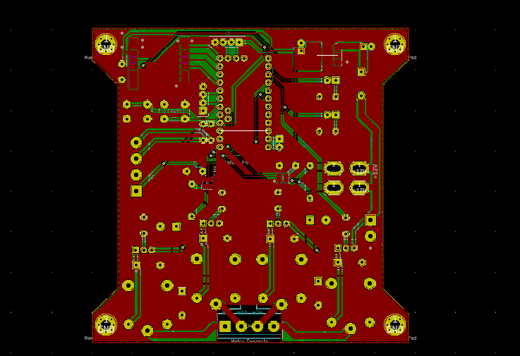
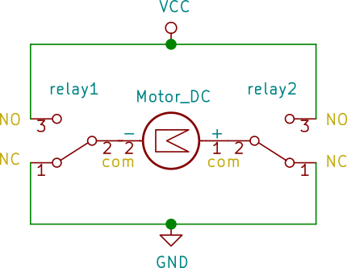

#### Remote linear actuator controller, for a diy open-source gate opener.

Having built a custom driveway gate and hinge setup I found myself shocked at what a quality dual-swing gate opener costs these days. More importantly, they have rather a lack of customization available in how you control or communicate with them, so I've set out to build my own with a pair of 12v linear actuators and a Semtech SX1287 LORA radio module. This is a work in progress.  

I'll be building a custom PCB for the whole thing, but I've tried to design this in such a way that any number of Arduino and related modules would work if hand-wired with jumpers, perfboard, breadboard, etc. Most parts are through-hole, and the ones that are surface mount are large enough hand soldering should be easy. Also makes for easy customization.

##### Current Status
Schematic is complete, finalizing PCB design. Programming will begin shortly, along with a software function writeup. Suggestions on improvements and ideas on how to integrate with existing home-automation setups is welcome.

##### Parts list and design criteria
* **2x 16" stroke linear actuators (12v)** - commercial gate openers are often much larger than this, but so often are the gates larger and heavier. My gates are quite lightweight tubing on ball-bearing hinges, so not much force is needed to open them. The two actuators I have claim a full load current of 3 amps, though I don't expect them to need much more than 1 to open and close these gates
* **2x 8Ah SLA batteries** - the driveway is long enough that trenching AC power out there would be a chore, so I'll be running this off a pair of ~$16 12v batteries and a small solar panel instead.
* **Arduino Pro mini 8Mhz/3.3v** - chosen so that I can avoid level shifting the SPI/I2C modules. An arduino Uno or Nano would work fine with proper level shifting
* **AI-thinker RA-02 Lora** radio - I've come to like these for designs that may be put in varied enclosures, as the IPX connector built-in means I can place the radio anywhere that's convenient and pipe the RF via coax to an optimal antenna placement.
* **4x 5volt SPDT relays** of proper current rating- The relays are in an H-Bridge topology that allows reversing of current through a DC motor(see below). This could be done a little cleaner with a pair of DPDT relays, but using these means the design will also work with the standard 4-place relay modules that are so popular.
* **2x INA219**- These can be had in SOT23-8 package, or available in several types of breakout boards. These will be the primary safety, which will watch the current going to each actuator. We'll test for a baseline current it usually takes to open a given gate (perhaps in a light breeze) and set that as our upper limit of motor current. If this current is exceeded, it likely means a gate is jammed or attempting to close on an object; so stop and reverse the gate.
  * Most of the pre-built modules I've seen for sale us a 2010 100ohm shunt resistor, allowing a maximum current of 3 amps. If your motors draw more than that, recalculate the needed resistor value
  * There will be enough exposed pins to add an electronic-eye, but I haven't planed for that yet.
* **2x mini ATM fuse**- the INA219 will handle over-current do to obstructions in the motor, these are just extra safety in case of a major hardware or wiring failure. Size appropriately to your wire sizes and motor current requirements.
* **AMS1117-3.3 or L7803 3.3v regulator**- because I've just stopped trusting the ratings for built-in arduino clone regulators. Just don't.
* **A MAG3110 or similar magnetometer**- this is optional, but I've decided to build-in my magnetometer driveway alarm into this same enclosure and power supply. It is described here: [magneto-driveway-alarm](www.gitlab.com/motivemachine/magneto-driveway-alarm)
  * The magnetometer from a more common IMU package (i.e. mpu9250) would likely also work well.

##### H-Bridge description
  
Shown here is the relay configuration in a simple H-Bridge. By switching seperate relays, any leg can be made positive, while the other remains grounded, causing the DC motor to be able to turn in two directions. This is very fault tolerant too- if any relay became stuck or failed, the motor would have either both leads grounded, or both leads at 12 volts, neither one of which would allow current to flow, therefore the motor will remain stopped. If the linear actuator is moving, it will of course stop when it reaches the built-in limit switches.
  Avid home DIY'ers might recognize this as similar to wiring a 3-way light switch, but backwards. The other difference is that AC power has no single direction of current flow, nor does a lightbulb care which way the current flows.
